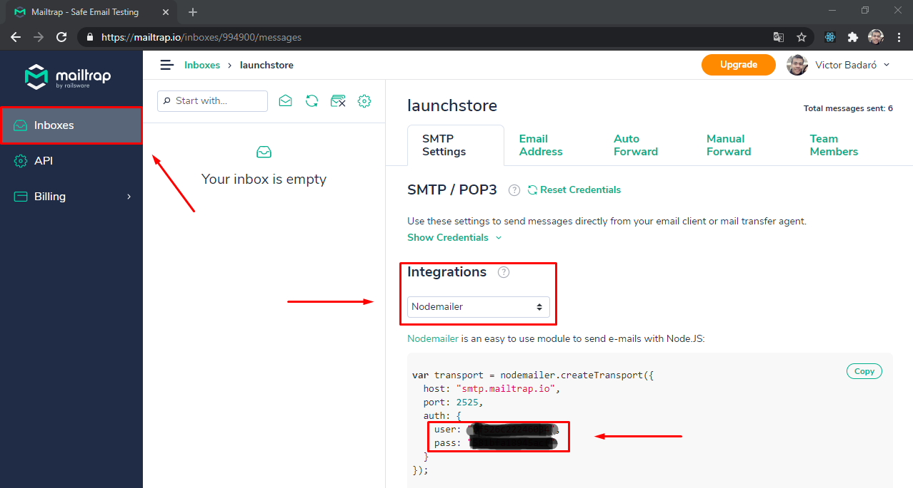

<p align="center">
    
</p>

<h1 align="center">
    
</h1>
<br>

## Indice

* [Sobre](#-sobre)
* [Tecnologias utilizadas](#-tecnologias-utilizadas)
* [Como baixar o projeto](#-como-baixar-o-projeto)
* [Como executar o projeto](#-como-executar-o-projeto)
<br>

## 🧾 Sobre

Aplicação WEB para apresentação de **receitas** elaboradas por diversos **chefs**.<br>
_(Este é um projeto criado durante o Bootcamp Launchbase da [Rocketseat](https://rocketseat.com.br/))_.
<br>

## 🚀 Tecnologias utilizadas

Este projeto foi desenvolvido utilizando as seguintes tecnologias:

1. Back-end
    * [NodeJS](https://nodejs.org/en/)
    * [express](https://expressjs.com/)
    * [multer](https://github.com/expressjs/multer)
    * [bcryptjs](https://github.com/dcodeIO/bcrypt.js)
    * [nodemailer](https://nodemailer.com/about/)
    * [method-override](https://github.com/expressjs/method-override)
    * [express-session](https://github.com/expressjs/session)
    * [connect-pg-simple](https://github.com/voxpelli/node-connect-pg-simple)
    * [pg](https://github.com/brianc/node-postgres)
    * [dotenv](https://www.npmjs.com/package/dotenv)
    * [browser-sync](https://www.browsersync.io/) (dependência de desenvolvimento)
    * [nodemon](https://nodemon.io/) (dependência de desenvolvimento)
    * [npm-run-all](https://github.com/mysticatea/npm-run-all) (dependência de desenvolvimento)
2. Front-end
    * HTML
    * CSS
    * Javascript
    * [nunjucks](https://mozilla.github.io/nunjucks/)
<br>

## 🔽 Como baixar o projeto

```bash
$ git clone https://github.com/victorbadaro/foodfy.git
```
<br>

## 💻 Como executar o projeto

Siga os passos abaixo:

1. Entre no diretório do projeto
    ```bash
    $ cd foodfy
    ```

2. Instale as dependencias do projeto
    ```bash
    $ npm install
    ```

3. Abra o arquivo `database.sql` e execute todos os comandos que estão nele dentro do teu banco de dados (Steps: 1, 2, 3 e 4)

    _Você deve ter o banco de dados [PostgreSQL](https://www.postgresql.org/download/) instalado na tua máquina_

4. Preencha as variáveis de ambiente contidas no arquivo .env na raíz do projeto
    Para ter usuário e senha da aplicação **Mailtrap** (utilizada para testar o envio de emails da aplicação Foodfy) você precisa criar uma conta em [https://mailtrap.io/](https://mailtrap.io/) e dentro de um dos teus **inboxes** selecionar a integração com o **Nodemailer** como na imagem abaixo:
    

    ```bash
    PORT=

    # DATABASE
    DB_USER=
    DB_PASSWORD=
    DB_HOST=
    DB_PORT=
    DB_DATABASE=foodfy

    # MAILTRAP
    MAILTRAP_USER=
    MAILTRAP_PASSWORD=
    ```

5. No terminal execute o seguinte comando para popular o banco de dados:

    ```bash
    $ node seed
    ```
    
    Se tudo executar corretamente a seguinte mensagem será apresentada no terminal:
    ```bash
    Database is ready to be used now
    Run one of the following commands on your terminal (without quotes):
    "npm run dev" (if you want to run the app on developer mode)
    "npm start" (if you want to run the app on production mode)
    ```
    ---
    **Atenção**: especificamente para executar o `seed.js` você deve, antes de executá-lo, colocar os dados de conexão do banco de dados diretamente no arquivo `src/config/db.js`, pois as variáveis de ambiente (.env) só funcionarão com o servidor executando. Após a execução do `seed.js` você poderá retornar o código original no arquivo `src/config/db.js`:

    ```javascript
    const { Pool } = require('pg');

    module.exports = new Pool({
        user: process.env.DB_USER,
        password: process.env.DB_PASSWORD,
        host: process.env.DB_HOST,
        port: process.env.DB_PORT,
        database: process.env.DB_DATABASE
    });
    ```

6. Execute um dos seguintes comandos no teu terminal<br><br>
    Para somente executar o projeto
    
    ```bash
    $ npm start

    # O endereço da tua aplicação estará disponível em http://localhost:3333
    ```
    <br>
    
    Para executar o projeto no mode desenvolvedor. Executando assim, o servidor reiniciará automaticamente quando alguma alteração for realizada no código do projeto e também já irá atualizar as páginas da aplicação quando alguma alteração for feita em sua estrutura ou estilização
    ```bash
    $ npm run dev

    # O endereço da tua aplicação estará disponível em http://localhost:3000
    ```
<br>

✅ Pronto! Se você seguiu corretamente os passos acima o projeto já estará sendo executado localmente em tua máquina.
<br>

---
<p align="center">Desenvolvido com ❤ por <a href="https://github.com/victorbadaro">Victor Badaró</a></p>